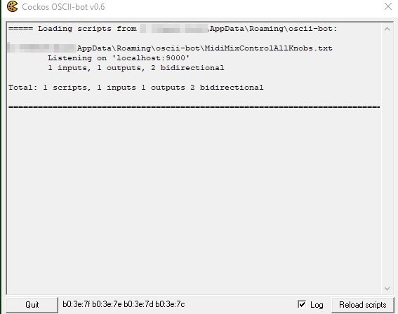
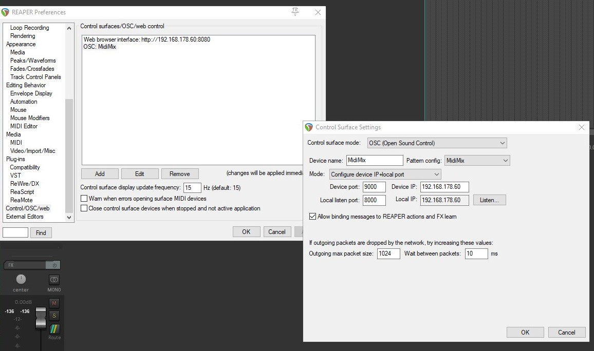
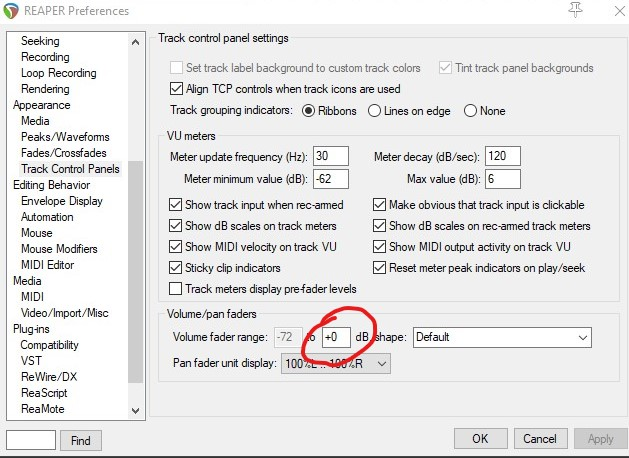
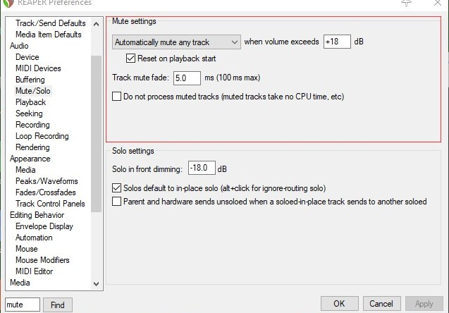

# AkaiMidiMixDubVersion

Get the package from goldenarpharazon posted here <https://forum.cockos.com/showpost.php?p=1638321&postcount=1>  
Full thread <https://forum.cockos.com/showthread.php?t=172908>  
The Package has info how to install and set it up  
Read the thread to get more infos if your in trouble  

Get the config-file MidiMixControlAllKnobsNosoftTakeover.txt  

Start the oscii-bot using this config-file.  
There are several possibilites to accompish this.
You can start oscii-bot.exe with the location of the config file as parameter.  
Or you can put the configfile where the original MidiMixControl.txt is located and gelete the MidiMixControl.txt afterwards (or rename it extension-wise or zip and delete it)  

For better performance you should tune the reaper's preferences.  
1. Set the columeFaderRange to +0 dB  (so the fader of the MidiMix can't overdo it)
2. Disable the setting 'Do not process mutued tracks' (as the MidiMix can mute tracks you prevent this setup from knacks)

I made two REAPER Projects.  
One with Softtakeover and one without  
you can test which is more comfortable  
i preferr the non soft-take-over for the dub-thing, so i don't have to wiggle over the correct value to get a reaction.  
i'm too blind to get the faders react without softtakeover.  
But starting the project with faders (a little bit above zero) in REAPER and on the MidiMix faders down and all knobs turned off (all to the left) down (or nearly down) is a good starting point.  

I made a JSFX (a variation of the 8 channel stereo Mixer from iX) to control the sends to the three effect tracks via the MidiMix.  
As it's in in the effects-folder of the project it will be loaded with the project  

[The Projects as Zip-File](20201003_DubSessionDeDeRe.zip) contains effects and audiodata (right click save as) 

some screenshots showing preferences and parameters and stuff

  
  
  
  

 
